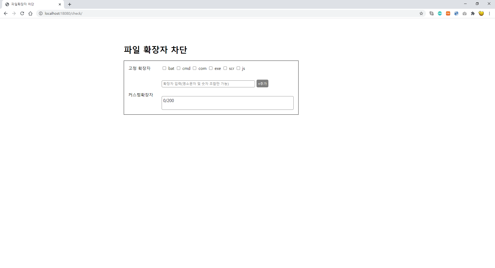
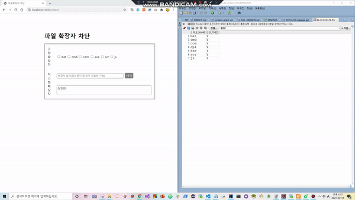

# 파일 확장자 차단 페이지 만들기

> ## 사용 기술스택

- #### Front End: JSP, Ajax, CSS, jQuery

- #### Back End
  - Framework
    - Spring 3.1.1.RELEASE
    - Maven 
    - Mybatis
   - Database: Oracle XE
   - Web Server : ApacheTomcat
   
- #### Tool
  - Eclipse
  - SQLDeveloper

<BR>

> ## 테이블 스키마 및 SQL

- #### SQL 쿼리문 (계정: SYSTEM)

```SQL
CREATE USER MADRAS IDENTIFIED BY MADRAS;
GRANT RESOURCE, CONNECT TO MADRAS;
```

<BR>

- #### SQL 쿼리문 (계정: MADRAS)
  - 파일 확장자 명을 PRIMARY KEY으로 하였습니다.
  - 고정파일과 커스텀파일의 구분을 IS_FIXED로 했습니다.

```SQL
DROP TABLE BLOCKED_FILES;
CREATE TABLE BLOCKED_FILES(
    FILE_NAME VARCHAR2(70),
    IS_FIXED VARCHAR2(5) DEFAULT 'N',
    PRIMARY KEY(FILE_NAME),
    CONSTRAINT CK_IS_FIXED CHECK(IS_FIXED IN ('Y', 'N')) 
);

COMMIT;

INSERT INTO BLOCKED_FILES VALUES('bat', 'Y');
INSERT INTO BLOCKED_FILES VALUES('cmd', 'Y');
INSERT INTO BLOCKED_FILES VALUES('com', 'Y');
INSERT INTO BLOCKED_FILES VALUES('cpl', 'Y');
INSERT INTO BLOCKED_FILES VALUES('exe', 'Y');
INSERT INTO BLOCKED_FILES VALUES('scr', 'Y');
INSERT INTO BLOCKED_FILES VALUES('js', 'Y');


INSERT INTO BLOCKED_FILES VALUES('git', 'N');
INSERT INTO BLOCKED_FILES VALUES('mp3', 'N');
INSERT INTO BLOCKED_FILES VALUES('avi', 'N');

COMMIT;
```

<BR>

> ## 결과 화면 UI

- #### 1. 초기화면



<br>

- #### 2. 시연




<br>

<br>

> ## 고려사항

- #### 1. 커스텀 확장자 파일 등록하기
  - 고정파일이나 기존에 등록된 커스텀 확장자 파일은 등록을 못하도록 했습니다.

- #### 2. 정규표현식을 이용하여 이름형식 확인
  - 숫자가 맨 앞에 오는 경우는 안됩니다.
  - 최대 20자까지 허용했습니다.

- #### 3. 등록된 커스텀 확장자 파일 삭제하기


